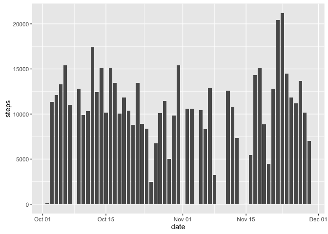
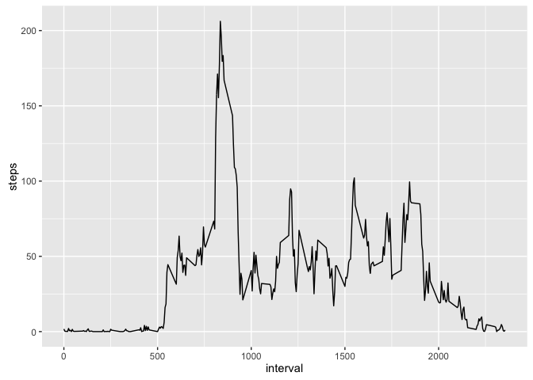
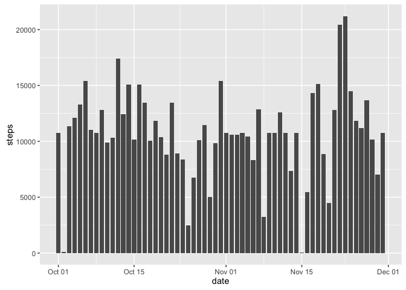
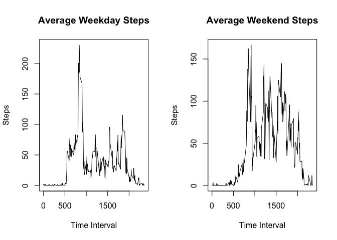

# Reproducible Research: Peer Assessment 1


#Activity Monitoring Data Project

==================================================================

## Loading and preprocessing the data

The following analysis explores daily step data collected from wearable activity monitoring devices. Steps are tracked in 5 minute intervals over the course of the day, and several days are tracked.

Begin by loading the required packages and data.
      

```r
library(ggplot2)
activity <- read.csv("activity.csv")
#Convert the date column in activity to date type
activity$date <- as.Date(activity$date, "%Y-%m-%d")
```

## What is mean total number of steps taken per day?

Calculate the total number of steps per day, and generate a time series plot.
Also, extrapolate the mean and median number of daily steps from the dailySteps data.


```r
#Create Data Frame Containing Total Steps Per Day
dailySteps <- aggregate(steps~date,data=activity, FUN=sum)

#Plot histogram of steps taken each day
g <- ggplot(dailySteps, aes(date, steps))
g+geom_bar(stat="identity", width=.8)
```

<!-- -->

```r
#Extrapolate mean and median of steps taken each day from dailySteps
mean(dailySteps$steps)
```

```
## [1] 10766.19
```

```r
median(dailySteps$steps)
```

```
## [1] 10765
```

## What is the average daily activity pattern?

Calculate the average steps taken per interval and create a time series graph of that data. Then, find the interval which had the highest number of steps on average.


```r
#Create Data Frame Containing Total Steps 
intervalSteps <- aggregate(steps~interval, data=activity, FUN=mean)

#Construct time series graph of average steps per interval from intervalSteps
g2 <- ggplot(intervalSteps, aes(interval, steps, group=1))
g2+geom_line()
```

<!-- -->

```r
#Find the interval with the highest average steps
intervalSteps[intervalSteps$steps==max(intervalSteps$steps),]$interval
```

```
## [1] 835
```

## Imputing missing values

Impute missing step values in activity by replacing missing values with the average number of steps taken in their corresponding interval.


```r
#Determine how many rows in activity contain NA values
sum(is.na(activity$steps) | is.na(activity$date) | is.na(activity$interval))
```

```
## [1] 2304
```

```r
#Create a copy of activity to impute data
activityImp <- activity

#"Impute" missing data by replacing missing values in activity with their corresponding averages from intervalSteps
for(i in 1:length(activityImp$steps)){
      if(is.na(activityImp$steps[i])){activityImp$steps[i] <- intervalSteps$steps[which(intervalSteps$interval==activityImp$interval[i])]
      }
}

#Confirm no NA's exist after imputation
sum(is.na(activityImp$steps) | is.na(activityImp$date) | is.na(activityImp$interval))
```

```
## [1] 0
```

## Are there differences in activity patterns between weekdays and weekends?

Recreate histogram of steps taken per day with newly imputed data, as well as find new mean and median numbers of daily steps.


```r
#Plot daily steps with newly imputed data
dailyStepsNew <- aggregate(steps~date,data=activityImp, FUN=sum)

g3 <- ggplot(dailyStepsNew, aes(date, steps))
g3+geom_bar(stat="identity", width=.8)
```

<!-- -->

```r
#Find the mean and median values of the total daily steps with imputed values
mean(dailyStepsNew$steps)
```

```
## [1] 10766.19
```

```r
median(dailyStepsNew$steps)
```

```
## [1] 10766.19
```

Subset the activity data set by the day of the week, extract the average number of steps for each interval during the weekdays and weekends, and then plot the extracted data.


```r
#Subset Based on day of week
weekendActivity <- subset(activityImp, as.POSIXlt(activityImp$date)$wday==6 | as.POSIXlt(activity$date)$wday==0)
weekdayActivity <- subset(activityImp, as.POSIXlt(activityImp$date)$wday!=6 & as.POSIXlt(activityImp$date)$wday!=0)

#Find average steps per interval by day of week
intervalStepsWeekend <- aggregate(steps~interval, data=weekendActivity, FUN=mean)
intervalStepsWeekday <- aggregate(steps~interval, data=weekdayActivity, FUN=mean)


#Construct weekend and weekday comparison chart
par(mfrow=c(1,2))
plot(x=intervalStepsWeekday$interval,y=intervalStepsWeekday$steps,xlab="Time Interval",ylab="Steps", type="l", main="Average Weekday Steps")
plot(x=intervalStepsWeekend$interval,y=intervalStepsWeekend$steps,xlab="Time Interval",ylab="Steps", type="l", main="Average Weekend Steps")
```

<!-- -->
